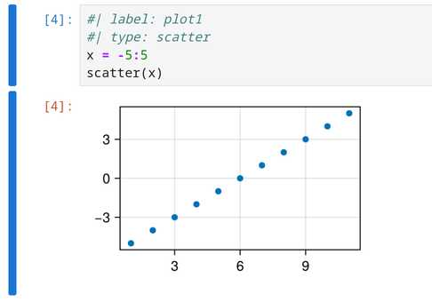
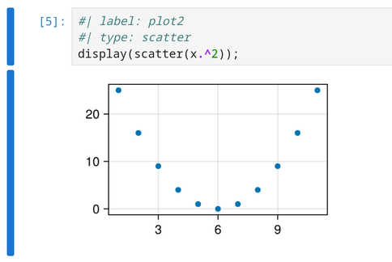

# Tutorial

Let's see how we can use Callisto to render a Jupyter notebook, or to extract the source and result of some computations. We will use the notebook `julia.ipynb` from the test directory. To run the examples yourself, you can [download](../tests/notebooks/julia.ipynb) the notebook and put it in a `notebooks` directory next to your Typst file.

## Configuration

We start by importing the latest version of the package:

```typst
#import "@preview/callisto:0.2.1"
```

We can now configure the package to work with a particular notebook. For this we call `config`:

```typst
#let (render, result) = callisto.config(
   nb: json("notebooks/julia.ipynb"),
)
```

The `config` call returns Callisto functions preconfigured with our settings. For a list of all functions (and all their parameters0 that can be configured by `config`, see the [function reference](Reference.md).

Here we only set the notebook, and from all the returned functions we only assign `render` and `result`. Now let's use them!

## Rendering

```typst
// Render the whole notebook
#render()
```

This *renders* the notebook: the cells are inserted in the Typst document:

-  Markdown cells are converted to formatted Typst content,

-  the source of each code cell is inserted as a Typst raw block (using the notebook kernel language to set the block `lang` for syntax highlighting),

-  the output of each code cell is inserted as a Typst image or text,

By default the cells are rendered with the `"notebook"` template, which  adds some styling to get a notebook look. We can choose the `"plain"` template to get elements without styling:

```typst
// Render notebook with the plain template
#render(template: "plain")
```

Note that we could have set this template directly in the `config` call.

Instead of working with the whole notebook, we can also refer to a single cell using its index, that is its position in the notebook:

```typst
This is the first cell:
#render(0)

This is the second cell:
#render(1)
```

This renders individual cells from `julia.ipynb`. We can also work with other notebooks whenever we want, either by calling `config` again, or by overriding the configuration when we call a function, as in `#render(0, nb: "notebooks/lorenz.ipynb")`.

## Item extraction

Instead of rendering the notebook, we might want to extract some parts, like the source of one cell, or its output, to insert them at some specific place in our Typst document. We can get a cell's result with the `result` function:

```typst
// Get the result of the first cell
#result(0)
```

This doesn't work... Indeed the first cell has no output: it's a markdown cell. Let's find a cell with a computation result. If we look in the notebook with the Jupyter interface, we see a code cell that begins with the following:

```
#| label: plot1
#| type: scatter
```

This is a cell **header**. In its internal processing, Callisto will convert these two lines to cell metadata, such that we can refer to this cell by the name `"plot1"`:

```typst
#result("plot1")
```

This works! The plot created by this cell is inserted in our Typst document.

The next cell has the following source:

```julia
#| label: plot2
#| type: scatter
display(scatter(x.^2));
```

So we can refer to this cell with `"plot2"`?

```typst
#result("plot2")
```

Again this doesn't work... Again because this cell has no result. In Jupyter, a code cell has a result only if the last line returns a value. Here the last line has a semicolon. With the Julia kernel that means the cell returns nothing. It still shows a plot, but as a **display object** rather than a result. The same cell can display many objects, but normally has only one result (or none at all).

In the Jupyter interface, there a visible hint that tells us if a particular output is a result:



This cell has execution count 4. It is shown in blue next to the source, and repeated in red next to the execution result.

On the other hand, the following cell has no result:



There is no execution count next to this plot: it's a display object, not a result.

OK, so let's get this display object. We need the `display` function for that, which we haven't assigned in the `config` call so let's call `config` again:

```typst
#let (render, result, display) = callisto.config(
   nb: json("notebooks/julia.ipynb"),
)

#display("plot2")
```

Good. Now the next cell with label `"plot3"` makes two display objects. Can we get them with `display`? Yes *but*: the `display` function returns a single object. By default it will complain if there are several matches, so we need to pick one with the `item` keyword:

```typst
#display("plot3", item: 0) // the first display
#display("plot3", item: 1) // the second display
```

By the way, this cell also has a result, and we know how to get it:

```typst
#result("plot3")
```

What if we don't really care if a cell shows a plot as a display or as a result? The `output` function can return all kind of cell outputs. Let's configure it for our notebook:

```typst
#let (render, result, display, output) = callisto.config(
   nb: json("notebooks/julia.ipynb"),
)

#output("plot1") // returns the cell result
#output("plot2") // returns the cell display
```

Let's say we want to get the last display or result produced by a cell. We can configure our own function to do just that:

```typst
#let my-output = output.with(
  output-type: ("display_data", "execution_result"),
  item: -1
)
```

Here we filter on the output type: we don't want to get errors or stream items (messages written to `stdout` or `stderr`).

Let's try it on the `"plot3"` cell:

```typst
#my-output("plot3")
```

Excellent. Now we might want to customize the looks of a plot. Show it centered, and resized to 75% of the text width. When Callisto returns a plot, it's in the form of a Typst `image` element, so we can change the width with a set rule:

```typst
#[
  #set image(width: 75%)
  #align(center, result("plot1"))
]
```

Here we wrap the whole thing in a `#[...]` block to limit the scope of the set rule, so that it doesn't affect other things in the document.

Another way to change the width would be to extract the image data from the `image` element, and use it to make a new `image` ourselves:

```typst
#let img-data = result("plot1").source
#let img = image(img-data, width: 75%)
#align(center, img)
```

Finally we might want to include a plot in a particular format. In a Jupyter notebook, the same cell output is often stored in multiple formats, to let the viewer choose their preferred format. For example a table can be stored as HTML which looks great for viewers that support it, but another copy is stored as plain text for other viewers.

In Callisto we can request a particular format using the `format` argument:

```typst
// Get the PNG version of this plot instead of the SVG
#result("plot1", format: "image/png")
```

This will only work if the cell stores a PNG version of this item. We can also ask for PNG if available, and fall back to SVG otherwise:

```typst
// Get PNG if available, or SVG as fallback
#result("plot1", format: ("image/png", "image/svg+xml"))
```

When `format` is `auto`, a default order of preference is used: `("image/svg+xml", "image/png", "text/markdown", "text/latex", "text/plain")`. We can also use the special value `auto` as an element of the array; The default list will then be inserted at that position:

```typst
// Get PNG if available, otherwise use default order
#result("plot1", format: ("image/png", auto))
```

## Using a cell's execution count

Instead of selecting code cells by label, we can use the *execution count*: as we mentioned already, when a cell is executed, Jupyter gives it a count like `[1]` or `[2]`. For example the `"plot1"` cell has execution count 4, and we can use it to identify the cell:

```typst
// Get "plot1" by execution count
#result(4, count: "execution")
```

If we want to do this a lot, we should make this behavior (counting execution rather than position) the default:

```typst
#let (render, result) = callisto.config(
   nb: json("notebooks/julia.ipynb"),
   count: "execution",
)
// Now this 4 refers to the execution count:
#render(4)
```

Note that the same cell will get a different count if it's executed again, and cells can be executed manually in any order so the order of execution counts might not reflect the position of cells in the document. And the execution count is defined only for code cells. For all these reasons, by default Callisto uses the cell index rather than its execution count.

## Extracting multiple items

Instead of extracting items one at a time, we can get an array of all the items that match a particular specification. For this we use the *plural form* functions of Callisto: each singular form such as `display` or `result` has a plural equivalent `displays`, `results`, ...

The usage is identical to the singular form, but the return value is an array, so we must join the elements if we want to insert them in the document:

```typst
#let (results, outputs) = callisto.config(
   nb: json("notebooks/julia.ipynb"),
)

// The number of outputs of the "plot3" cell
#outputs("plot3").len()

// Insert all the outputs in the document
#outputs("plot3").join()

// Get the results of all code cells of the notebook
#results()
```

Note: the singular forms like `result` are implemented as small wrappers around the plural forms.

## Rendering single cells

We now go back to rendering. The functions `In` and `Out` can be used to render just the input or output of a particular code cell, while `Cell` will render both. Let's configure these functions to use our notebook:

```typst
#let (Cell, In, Out) = callisto.config(nb: json("notebooks/julia.ipynb"))
```

We can now render the input and and output of `"plot1"` separately:

```typst
The following code:
#In("plot1")
produces the following figure:
#Out("plot1")
```

or together:

```typst
#Cell("plot1")
```

What's the difference then between `#render("plot1")` and `#Cell("plot1")`? The `Cell` call does an additional check: it raises an error if it finds more than one cell (or no cell) matching `"plot1"`.

Note: the functions `Cell`, `In` and `Out` are implemented as aliases of the `render` function. For example `In` is just the `render` function preconfigured with arguments `output: false` and `keep: "unique"`. See the [function reference](Reference.md) for a description of all function arguments and all aliases.
